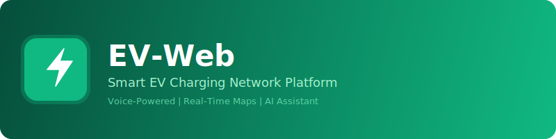

<p align="center">
  
</p>

<p align="center">
  
</p>

<h3 align="center">Smart EV Charging Network Platform</h3>

<p align="center">
  A modern, voice-powered electric vehicle charging management platform with real-time station maps, live session monitoring, and an integrated AI assistant (EVA).
</p>

<p align="center">
  
  
  
  
  
  
</p>

---

## Features

### Interactive Station Map
- Real-time EV charging station discovery on an interactive Leaflet map
- Geolocation-based nearby station search with distance labels
- Route optimization using nearest-neighbor algorithm with haversine distance
- Station grouping by location with color-coded status indicators
- Charging speed classification: **Ultra-fast** (150+ kW), **Fast** (50+ kW), **Normal**

### Live Charging Sessions
- Start/stop charging sessions with real-time monitoring
- Live stats: power draw (kW), energy consumed (kWh), elapsed time, running cost
- Circular SOC (State of Charge) progress indicator
- Estimated completion time with 5-second polling intervals
- Automatic session state management

### EVA Voice Assistant
- Real-time bidirectional audio communication via WebSocket
- Dual AudioContext architecture (16 kHz input / 24 kHz output)
- AudioWorklet-based browser audio processing
- Live waveform visualization on canvas
- Text fallback with chat overlay and message history
- Exponential backoff reconnection (up to 5 attempts)

### Wallet & Payments
- Digital wallet with BRL (Brazilian Real) currency support
- Add funds with preset amounts (R$20, R$50, R$100) or custom values
- Complete transaction history with detailed receipt cards
- Per-session cost breakdown: energy, duration, charge point

### Authentication
- CPF-based login with automatic formatting (000.000.000-00)
- Guest access with visitor CPF (`000.000.000-00`)
- JWT token management with automatic refresh on 401
- Role-based access (user, operator, admin)

---

## Tech Stack

| Layer | Technology |
|-------|-----------|
| **Framework** | React 19 + TypeScript 5.9 |
| **Bundler** | Vite 7.3 |
| **Styling** | TailwindCSS 4.2 (Vite plugin) |
| **Routing** | React Router 7 (lazy-loaded pages) |
| **State** | React Query 5 (server) + useState (UI) |
| **Maps** | Leaflet 1.9 + react-leaflet 5 |
| **HTTP** | Axios 1.13 (interceptors + auto-refresh) |
| **Audio** | Web Audio API + AudioWorklet |
| **Real-time** | WebSocket (EVA voice sessions) |
| **Icons** | Lucide React |
| **Notifications** | Sonner |

---

## Architecture

```
src/
├── components/
│   ├── ui/              # Button, Modal, LoadingSpinner
│   ├── station/         # StationMap, StationList, ConnectorCard
│   ├── charging/        # ChargingMonitor, ChargingStats
│   ├── wallet/          # WalletBalance, ReceiptCard
│   └── eva/             # EvaVoiceButton, EvaWaveform, EvaChatBubble
├── hooks/
│   ├── useAuth.ts       # Login, register, logout, token refresh
│   ├── useCharging.ts   # Start/stop sessions, history, active polling
│   ├── useStations.ts   # Nearby/all stations, single station fetch
│   ├── useWallet.ts     # Balance, deposits, payments
│   ├── useGeolocation.ts# HTML5 Geolocation with fallback
│   ├── useEvaSession.ts # EVA voice lifecycle + WebSocket
│   └── useAudioEngine.ts# Mic capture, playback, waveform drawing
├── pages/
│   ├── HomePage.tsx     # Map + station list + EVA button
│   ├── LoginPage.tsx    # CPF login + visitor mode
│   ├── StationPage.tsx  # Station details + connector selection
│   ├── ChargingPage.tsx # Live session monitor
│   ├── WalletPage.tsx   # Balance + add funds + history
│   └── ProfilePage.tsx  # User info + navigation
├── services/
│   ├── api.ts           # Axios instance + interceptors
│   └── websocket.ts     # WebSocket client for EVA
├── types/               # TypeScript interfaces
└── utils/
    ├── formatters.ts    # Currency, kWh, power, duration, distance
    ├── audioUtils.ts    # Base64 encode/decode, WAV/MP3 processing
    └── station.ts       # Station data helpers
```

---

## Quick Start

### Prerequisites

- **Node.js** 20+
- **npm** 10+

### Installation

```bash
git clone https://github.com/JoseRFJuniorLLMs/EV-Web-IA.git
cd EV-Web-IA
npm install
```

### Development

```bash
npm run dev
```

Open [http://localhost:3000](http://localhost:3000)

### Production Build

```bash
npm run build
npm run preview
```

### Environment Variables

Create a `.env` file:

```env
VITE_API_URL=https://your-api-server.com
VITE_API_PREFIX=/ev-api/v1
```

---

## Deployment

### Nginx (Production)

```bash
npm run build
# Copy dist/ to your web server
sudo cp -r dist/* /var/www/eva-web/
sudo chown -R www-data:www-data /var/www/eva-web/
sudo systemctl reload nginx
```

Nginx location config:

```nginx
location /eva/ {
    alias /var/www/eva-web/;
    index index.html;
    try_files $uri $uri/ /eva/index.html;
}
```

### Docker

```bash
docker build -t ev-web .
docker run -p 3000:80 ev-web
```

---

## API Endpoints

| Method | Endpoint | Description |
|--------|----------|-------------|
| `POST` | `/auth/login` | Login with CPF + password |
| `POST` | `/auth/register` | Create new account |
| `GET` | `/auth/me` | Get current user |
| `POST` | `/auth/refresh` | Refresh JWT tokens |
| `GET` | `/devices` | List all charging stations |
| `GET` | `/devices/nearby` | Nearby stations (lat/lon/radius) |
| `GET` | `/devices/:id` | Station details |
| `POST` | `/transactions/start` | Start charging session |
| `POST` | `/transactions/:id/stop` | Stop charging session |
| `GET` | `/transactions/active` | Current active session |
| `GET` | `/transactions/history` | Transaction history |
| `GET` | `/wallet` | Wallet balance |
| `POST` | `/wallet/deposit` | Add funds |

---

## WebSocket Protocol (EVA Voice)

```
Client                          Server
  │                                │
  ├─ { type: "config",            │
  │    data: "JWT_TOKEN" }  ──────►│
  │                                │
  │◄────── { type: "status",      │
  │          text: "ready" }       │
  │                                │
  ├─ { type: "audio",             │
  │    data: "BASE64..." }  ──────►│  (16 kHz PCM chunks)
  │                                │
  │◄────── { type: "audio",       │  (24 kHz response)
  │          data: "BASE64..." }   │
  │                                │
  │◄────── { type: "text",        │  (transcription)
  │          text: "Hello..." }    │
  │                                │
  │◄────── { type: "status",      │
  │          text: "turn_complete"}│
  └────────────────────────────────┘
```

---

## Pages

| Page | Route | Description |
|------|-------|-------------|
| Login | `/login` | CPF authentication, visitor mode |
| Register | `/register` | New user registration |
| Home | `/` | Interactive map, station list, EVA button |
| Station | `/station/:id` | Station details, connector selection |
| Charging | `/charging` | Live session monitoring |
| Wallet | `/wallet` | Balance, add funds, receipts |
| History | `/history` | Full transaction history |
| Profile | `/profile` | User settings, logout |

---

## Design System

| Element | Value |
|---------|-------|
| **Primary** | Emerald `#10b981` |
| **Accent** | Violet `#7c3aed` |
| **Border Radius** | `rounded-xl` (12px) |
| **Shadows** | `shadow-lg` for elevated cards |
| **Layout** | Mobile-first, flexbox |
| **Typography** | System font stack |

---

## License

This project is licensed under the **AGPL-3.0** License.

---

<p align="center">
  
  <br/>
  <sub>Built with React, TypeScript, and EVA AI</sub>
  <br/>
  <sub>Copyright (C) 2025-2026 Jose R F Junior</sub>
</p>
